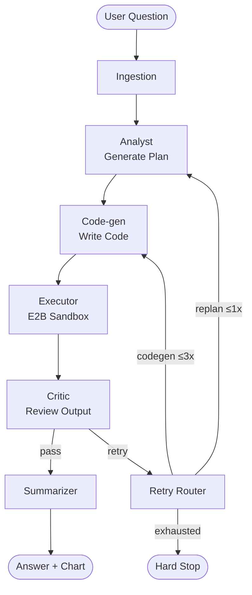

# Data Analysis Agent

A multi-agent LangGraph pipeline that answers natural-language questions about CSV data using Groq (Llama 3.3 70B) and executes code in E2B cloud sandboxes.

---

## Features

- Multi-turn conversation with sliding-window memory
- LLM-generated pandas + matplotlib code executed in isolated E2B sandboxes
- Two-level retry loop (code-gen × 3 → re-plan × 1)
- Hybrid rule-based + LLM critic
- Inline chart display
- Session report download
- LangSmith tracing for every node

---

## Architecture



---

## Tech Stack

- [LangGraph](https://github.com/langchain-ai/langgraph)
- [LangChain](https://github.com/langchain-ai/langchain)
- [Groq / Llama 3.3 70B](https://groq.com)
- [E2B Code Interpreter](https://e2b.dev)
- [Streamlit](https://streamlit.io)
- pandas, matplotlib
- [LangSmith](https://smith.langchain.com)
- Docker, Railway

---

## Live Demo

**[data-analysis-agent-production-37db.up.railway.app](https://data-analysis-agent-production-37db.up.railway.app)**

---

## Run Locally

```bash
git clone https://github.com/shreyanshverma7/data-analysis-agent
cd data-analysis-agent
pip install -r requirements.txt
cp .env.example .env   # fill in your keys
streamlit run app.py
```

**Required environment variables** (`.env`):

```
GROQ_API_KEY=
E2B_API_KEY=
LANGCHAIN_API_KEY=
LANGCHAIN_TRACING_V2=true
LANGCHAIN_PROJECT=data-analysis-agent
```

---

## Screenshots

<!-- Add screenshots here -->
