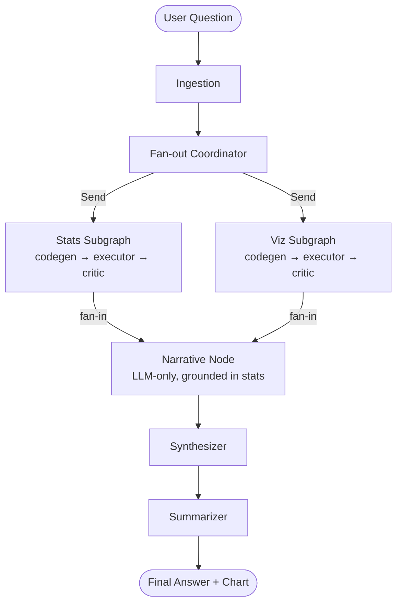
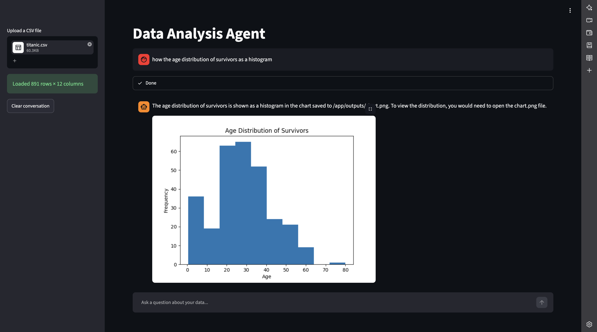
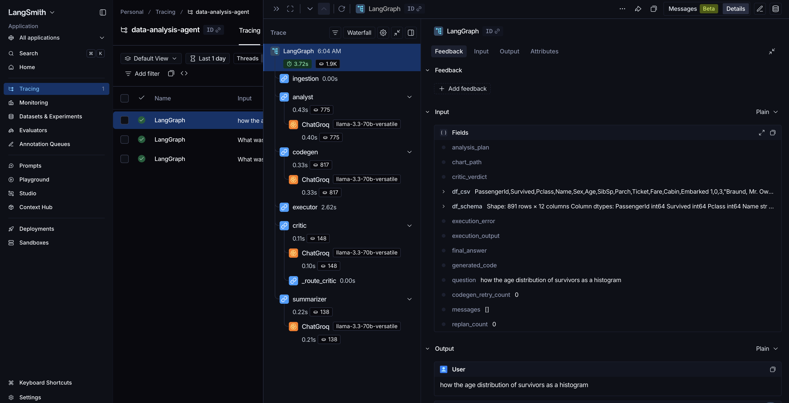

# Data Analysis Agent


A multi-agent LangGraph pipeline that answers natural-language questions about CSV data using Groq (Llama 3.3 70B) and executes code in E2B cloud sandboxes.

---

## V1 Features

- Multi-turn conversation with sliding-window memory
- LLM-generated pandas + matplotlib code executed in isolated E2B sandboxes
- Two-level retry loop (code-gen × 3 → re-plan × 1)
- Hybrid rule-based + LLM critic
- Inline chart display
- Session report download
- LangSmith tracing for every node

---

## V2 Features

- **Parallel specialist agents** — Stats and Viz agents run concurrently via LangGraph's Send API, reducing total latency
- **Hybrid execution model** — Narrative agent runs sequentially after stats, grounding its interpretation in real computed numbers (zero hallucination risk)
- **LLM-as-judge eval framework** — 15-question eval dataset with deterministic numeric checks + LLM semantic scoring across three dimensions: numeric accuracy, completeness, clarity
- **LangSmith experiment tracking** — Eval results stored as named experiments, visible alongside trace data
- **Graceful partial failure** — Single specialist failure degrades gracefully; both computation agents failing triggers a hard stop with a clear error message

---

## V3 Features

- **Multi-format upload** — Accepts CSV, Excel (`.xlsx`, `.xls`), and JSON in addition to CSV
- **Adaptive routing** — Fan-out inspects the dataset schema; viz specialist is skipped for non-numeric datasets, avoiding wasted retries
- **Generalization proven on two datasets** — Evaluated on Titanic (891 rows) and UCI Red Wine Quality (1,599 rows, 12 numeric columns)

---

## V4 Features

- **Structured outputs** — Four LLM nodes (`AnalysisPlan`, `CriticVerdict`, `NarrativeOutput`, `SynthesisOutput`) use Pydantic schemas via `.with_structured_output()` for typed, reliable parsing. Codegen nodes intentionally stay on plain generation — JSON mode cannot serialize multi-line Python code.
- **LiteLLM provider abstraction** — `get_llm()` returns a `RunnableWithFallbacks` chaining `openai/gpt-oss-120b` (primary) to `groq/llama-3.3-70b-versatile` (fallback). All nodes are provider-agnostic; adding a new provider requires only a config change.
- **CI eval gate** — GitHub Actions runs the first 5 Titanic questions on every PR to `main`. Blocks merge if numeric accuracy drops below 0.80 or chart correctness below 4/5. Posts a score summary as a PR comment.
- **UI improvements** — Dataset preview (head + describe), sidebar metadata (rows / columns / format), heuristic suggested questions on first load, elapsed time and token estimate displayed per answer.

---

## Eval Results

Evaluated on two datasets using a hybrid framework — deterministic numeric checks + LLM-as-judge semantic scoring (`openai/gpt-oss-20b`).

| Dataset | Questions | Numeric accuracy | Completeness | Clarity | Chart correct |
|---|---|---|---|---|---|
| Titanic (V2) | 15 | 0.93 | 0.91 | 0.95 | 15/15 |
| Wine Quality (V3) | 10 | 1.00 | 0.92 | 0.96 | 10/10 |

> Numeric accuracy is checked deterministically (float parsing + tolerance). Completeness and clarity are scored by an LLM judge.

---

## Architecture



---

## Tech Stack

- [LangGraph](https://github.com/langchain-ai/langgraph)
- [LangChain](https://github.com/langchain-ai/langchain)
- [Groq / gpt-oss-120b](https://groq.com)
- [E2B Code Interpreter](https://e2b.dev)
- [Streamlit](https://streamlit.io)
- pandas, matplotlib
- [LangSmith](https://smith.langchain.com)
- Docker, Render

---

## Status

`v0.4 shipped, iterating on V5` — see [`docs/06-ITERATE.md`](docs/06-ITERATE.md) for the metric
check and the iterate/archive decision.

---

## Docs

Built with Project OS — full lifecycle docs in [`docs/`](docs/):

| Doc | What's in it |
|---|---|
| [`00-INTAKE.md`](docs/00-INTAKE.md) | The idea, category/tier, success definition |
| [`01-VALIDATION.md`](docs/01-VALIDATION.md) | Competitor scan, platform-risk check, GO verdict |
| [`02-PRD.md`](docs/02-PRD.md) | Scope — Must / Should / Won't, success metric, scope-change log |
| [`03-SYSTEM-DESIGN.md`](docs/03-SYSTEM-DESIGN.md) | Architecture, state contracts, ADRs, cross-cutting concerns |
| [`04-CODE-PLAN.md`](docs/04-CODE-PLAN.md) | Milestones and tasks — the live tracker |
| [`05-TEST-LAUNCH.md`](docs/05-TEST-LAUNCH.md) | Acceptance verification, test gaps, launch checklist |
| [`06-ITERATE.md`](docs/06-ITERATE.md) | Post-ship metric check, retro, next-version decision |

Engineering conventions: [`CODING_STANDARDS.md`](CODING_STANDARDS.md).
AI-session context: [`CLAUDE.md`](CLAUDE.md).

---

## Live Demo

**[data-analysis-agent-qrj3.onrender.com](https://data-analysis-agent-qrj3.onrender.com)**

> Hosted on Render's free tier — the instance spins down after ~15 minutes of inactivity, so the first load can take 30–60 seconds.

---

## Run Locally

```bash
git clone https://github.com/shreyanshverma7/data-analysis-agent
cd data-analysis-agent
pip install -r requirements.txt
cp .env.example .env   # fill in your keys
streamlit run app.py
```

**Required environment variables** (`.env`):

```
GROQ_API_KEY=
E2B_API_KEY=
LANGCHAIN_API_KEY=
LANGCHAIN_TRACING_V2=true
LANGCHAIN_PROJECT=data-analysis-agent
```

> `GROQ_API_KEY` and `E2B_API_KEY` are also required as **GitHub Actions secrets** to run the CI eval gate on pull requests.

---

## Screenshots

**Streamlit UI — inline chart answer**


**LangSmith trace — node-by-node breakdown**


---

## Known Limits

- **Type 2 sequential questions** — Questions where the visualization depends on specific intermediate results from the stats agent (e.g. "find the 3 most correlated features, then plot only those") are not supported. Both agents start from the same input and cannot pass intermediate results to each other. Standard filter-then-compute questions ("show survival rate for passengers over 60") work correctly as each agent independently applies the full computation.
