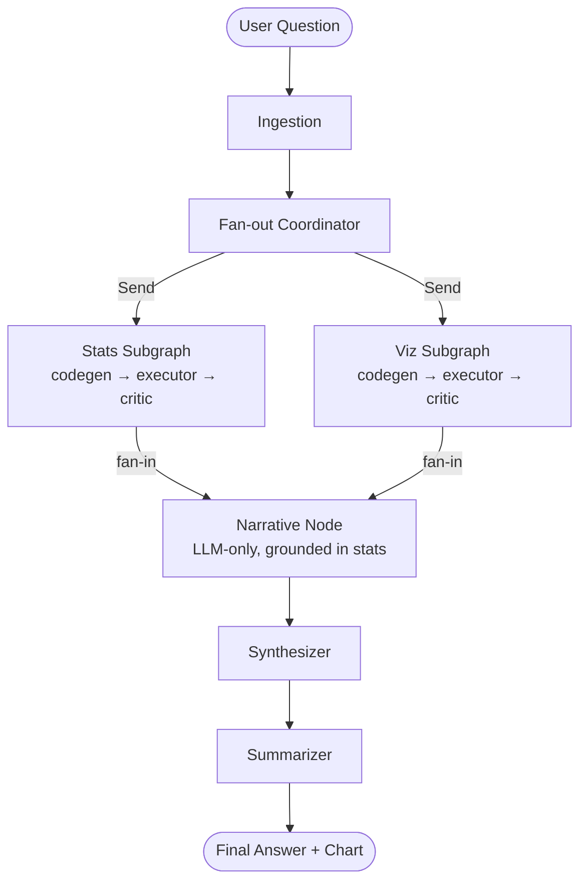
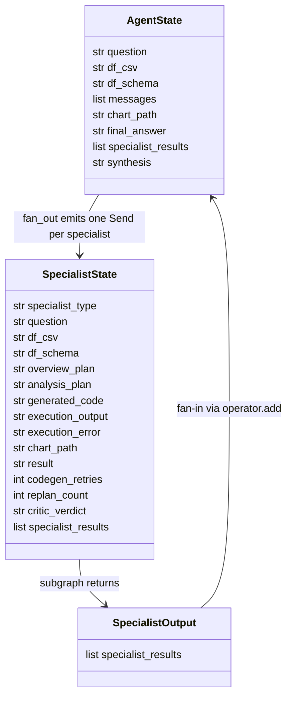

# 03 — System Design: Data Analysis Agent

> Stage 3. Exit gate: another engineer (or Claude Code) could build this without asking questions. See PLAYBOOK.md → Stage 3.
> Tier 1: architecture diagram + tech stack table only.

> **Retroactive.** Written 2026-07-29. This describes the system **as built and deployed**, not a
> design authored ahead of it. Where the shipped design deviates from what the standards or the
> README claim, the deviation is stated here rather than smoothed over.

## ⚠️ Current production status (2026-07-29)

Two facts that a reader of this document needs before trusting the stack table below:

1. **The pinned LLM is deprecated and the live demo is down.** Groq retired
   `meta-llama/llama-4-scout-17b-16e-instruct`; it is no longer served on the project's key. Every
   run — local, CI, and production — fails.
2. **The LiteLLM fallback chain has never worked.** `config.get_llm()` passes
   `fallbacks=[ChatLiteLLM(...)]`, but `ChatLiteLLM` defines no `fallbacks` field, so the kwarg is
   silently absorbed. The "provider abstraction with fallback" capability described below and in
   the README is, as of this writing, **decorative**. Had it worked, the deprecation above would
   have degraded to the 70B model and gone unnoticed.

Both are diagnosed and scoped as **HOTFIX H1** in the frozen `AGENT_STEPS.md`, which has not been
executed. The stack table below documents the design as it currently stands in source; it is not a
statement that the system is healthy.

## Requirements audit (run BEFORE designing — Musk's algorithm, P11)

*Run retroactively — this is an audit of what got built, and the honest output is a delete-list
that was never applied.*

1. **Question:** Each shipped component traces to a Must-story in `02-PRD.md` — with one exception.
   The LiteLLM provider abstraction (U-none) has no Must-story behind it; it was added because
   provider-agnosticism sounded like good engineering, not because a requirement demanded it. It
   is also the component that turned out not to work. That is the audit working exactly as
   intended, four versions late.
2. **Delete:** `agent.py`'s interactive CLI loop is dead weight — Streamlit is the only entry point
   anyone uses; it survives as a debugging convenience. The separate `summarizer` node after
   `synthesizer` is a second LLM pass over text that the synthesizer already produced in structured
   form, and is a candidate for deletion. Neither has been removed; both are named here so the next
   pass has a starting list.
3. **Simplify** what's left, **accelerate** only after that, **automate** last. Applied honestly:
   no database, no backend API, no auth, no queue. The simplification that *was* skipped is the
   one in point 1 — an abstraction layer was added before a second provider ever existed.

> Tie-breaker rule (P12): genuinely torn between two designs? Prototype both in a day; let evidence pick.

## Architecture overview

<!-- Same diagram as README.md — README is the copy, this is the source of truth. -->

**How a core request flows:**
The user uploads a file in Streamlit (`app.py`) and asks a question; `agent.run_agent()` seeds an
`AgentState` and invokes the compiled LangGraph (`graph.py`). The `ingestion` node normalizes the
dataframe into a CSV string plus a schema summary, then `fan_out_node` — wired as a conditional
edge, not a node — inspects that schema and returns `Send` objects: both stats and viz subgraphs
when numeric columns are present, stats alone when they are not. Each subgraph runs
codegen → executor → critic independently, with the executor running generated pandas/matplotlib
inside an E2B sandbox and the critic deciding pass-or-retry (codegen ×3, then re-plan ×1). Results
fan in on `specialist_results`, an `operator.add`-reduced list; the narrative node interprets the
*real* stats output, the synthesizer combines stats, chart, and narrative into a typed
`SynthesisOutput`, and the summarizer produces the final text returned to the UI with the chart
path.

## Tech stack & trade-offs

| Layer | Choice | Why (vs. what alternative) |
|---|---|---|
| Frontend | **Streamlit** (`app.py`) | The only layer — no separate frontend. Chosen over Next.js + a FastAPI backend because a single-user portfolio demo does not justify two deployables. Cost accepted: no real component model, UI logic and orchestration entry point live in the same file |
| Backend | **None — Streamlit process is the backend** | LangGraph is invoked in-process via `agent.run_agent()`. Alternative was FastAPI + a queue for long-running graph runs; rejected as premature for single-user, single-request usage |
| Orchestration | **LangGraph / LangChain** | Explicit graph with a parallel Send-API fan-out and typed state, over hand-rolled async orchestration. The graph *being legible* is a large part of this project's point |
| Database | **None** | State is in-memory per session; the uploaded file is serialized to a CSV string inside `AgentState`. See ADR-1 — a deliberate simplicity call, not an oversight |
| Hosting | **Docker + Render** (free tier) | Migrated from Railway when its free tier ended (Phase 34). Single stateless container, blueprint in `render.yaml`, health check on `/_stcore/health` |
| Auth | **None** | No accounts, no per-user data — auth would exist only to protect data the app doesn't store. Explicit Won't in `02-PRD.md` |
| AI/LLM | **Groq — Llama 4 Scout 17B primary, Llama 3.3 70B fallback, via LiteLLM** (`config.get_llm()`) | Groq for free-tier throughput; Scout over 70B because a single 15-question eval run exhausted 70B's daily token cap. **Both halves of this row are currently broken — see the production-status block above.** |
| Code execution | **E2B Code Interpreter** | Generated code runs in an isolated cloud sandbox rather than a local `PythonREPLTool`. This is the grounding mechanism and the security boundary in one |
| Compute / viz | **pandas + matplotlib** | Executed inside the sandbox; charts written out and surfaced by path |
| Observability | **LangSmith** | Per-node tracing, and eval runs recorded as named experiments |
| Evals | **Custom harness** (`evals/`) — deterministic numeric checks + LLM-as-judge | Numeric accuracy must not be scored by a model; completeness and clarity can be. Split accordingly |

## Data model (Tier 2+)

**There is no ERD — there is no database.** The real data contract in this system is the LangGraph
state that flows between nodes, defined in `state.py`. Documenting that instead is the honest
substitution.

Notes the diagram can't carry:

| Field | Detail |
|---|---|
| `AgentState.specialist_results` | `Annotated[list, operator.add]` — the fan-in reducer |
| `SpecialistState.specialist_type` | `"stats"` or `"viz"` |
| `SpecialistOutput` | Exists solely to give subgraphs a narrow return schema — added in Phase 14.3 to fix `INVALID_CONCURRENT_GRAPH_UPDATE` on fan-in |
| `AgentState.df_csv` | The entire uploaded dataset, serialized to a CSV string. This is the practical file-size ceiling |

Key property: `specialist_results` is the only reduced channel. Parallel subgraphs may write it
concurrently; every other field is written by exactly one node, which is what makes the parallel
fan-out safe without locking.

**Structured LLM output contracts** (`schemas.py`) — the typed boundary between model and graph:

| Schema | Used by | Fields |
|---|---|---|
| `AnalysisPlan` | `nodes/specialists/stats.py`, `viz.py` | `steps: list[str]`, `expected_output_type: numeric\|chart\|both` |
| `CriticVerdict` | `nodes/specialists/stats.py` | `verdict: pass\|retry`, `reason: str` |
| `NarrativeOutput` | `nodes/narrative.py` | `interpretation: str`, `key_numbers: list[str]` |
| `SynthesisOutput` | `nodes/synthesizer.py` | `answer: str`, `has_chart: bool`, `confidence: high\|medium\|low` |

Codegen nodes are deliberately **not** on structured output — Groq's JSON mode cannot carry
multi-line Python source.

## API contract (Tier 2+)

**N/A — there is no HTTP API.** Streamlit is the only interface; there is no service boundary to
contract. The closest equivalents are the two in-process entry points, recorded here so the shape
is explicit:

| Entry point | Signature | Purpose |
|---|---|---|
| `agent.run_agent` | `(question: str, messages: list, df_csv: str = "", df_schema: str = "") -> {answer, chart_path, messages}` | Single call the UI makes per question; wraps `graph.invoke()` |
| `graph.graph` | `StateGraph(AgentState).compile()` | The compiled pipeline; invoked with an `AgentState` dict |

The only externally-reachable HTTP surface is Streamlit's own, including `/_stcore/health`, which
Render uses as the health check.

## Key decisions (ADRs, Tier 3)

### ADR-1: No database — stateless, in-memory sessions
- **Context:** Single-user portfolio demo. Nothing is multi-tenant; nobody returns to a saved
  analysis. The uploaded dataset is small enough to carry as a string.
- **Decision:** Keep all state in LangGraph's in-memory `AgentState` for the life of one request,
  with Streamlit's session state holding conversation history. Serialize the dataframe to a CSV
  string in `df_csv`. No persistence layer of any kind.
- **Alternatives considered:** Postgres session store (accounts, saved analyses, history);
  SQLite-on-disk (survives restarts, breaks on Render's ephemeral filesystem); object storage for
  uploaded files.
- **Consequences:** Ops surface is one container and zero backing services; deploys are trivially
  rollback-able. Cost: nothing survives a restart or a cold start, conversation history dies with
  the tab, and carrying the dataset as a string in state puts a practical ceiling on file size.
  Accepted deliberately for Tier 2 — a database here would exist to serve requirements the PRD
  explicitly disclaims.

### ADR-2: Sandboxed execution over local execution
- **Context:** The core value claim is that numbers are computed, not generated. That requires
  actually running model-written code.
- **Decision:** Execute all generated pandas/matplotlib in an **E2B Code Interpreter** sandbox.
  V1 used LangChain's local `PythonREPLTool`; that was replaced in Phase 6.
- **Alternatives considered:** Local `PythonREPLTool` (fast, free, and executes arbitrary
  LLM-written code in the app's own process); a container-per-run on the host; a restricted-builtins
  Python subset.
- **Consequences:** Grounding and the security boundary are the same mechanism. Cost: a network
  round-trip and sandbox cold start per execution, a third-party API dependency, and an extra key
  (`E2B_API_KEY`) required for CI.

### ADR-3: Parallel specialists via Send, narrative kept sequential
- **Context:** Stats and viz are independent given the same input; interpretation is not — it must
  read real computed numbers or the grounding claim collapses.
- **Decision:** Fan out stats and viz concurrently through LangGraph's Send API, fan in on the
  `operator.add`-reduced `specialist_results`, and run the narrative node **after** the fan-in.
  `fan_out_node` is a conditional edge, and it skips the viz specialist entirely when the schema
  shows no numeric columns rather than letting it fail and retry.
- **Alternatives considered:** Fully sequential (simpler, slower); all three parallel including
  narrative (fastest, and hallucination-prone — narrative would have no stats to ground in).
- **Consequences:** Latency roughly bounded by the slower specialist instead of their sum, and one
  specialist failing degrades gracefully while both failing hard-stops with a clear message. Cost:
  the known limit in the README — specialists cannot pass intermediate results to each other, so
  "find the top-3 correlated features, then plot only those" is unsupported.

## Cross-cutting concerns

- **Error handling:** Two-level retry inside each specialist — codegen ×3, then re-plan ×1 — driven
  by a `CriticVerdict`. A single specialist failing degrades gracefully; both failing produces a
  hard stop with a user-readable message. `agent.run_agent()` wraps `graph.invoke()` in a
  catch-all that returns an empty answer rather than raising into the UI. **Known gap:** that
  catch-all `print`s and swallows the exception, which is exactly how the H1 model deprecation
  reached users as an opaque failure instead of a legible one.
- **Config/secrets:** `.env` + `.env.example` (per `CODING_STANDARDS.md`). `config.py` raises at
  import if `GROQ_API_KEY` is missing. Required: `GROQ_API_KEY`, `E2B_API_KEY`,
  `LANGCHAIN_API_KEY`, `LANGCHAIN_TRACING_V2`, `LANGCHAIN_PROJECT`. The first two are also required
  as GitHub Actions secrets for the CI eval gate. Secrets are marked `sync: false` in
  `render.yaml` and entered in the Render dashboard.
- **Logging/observability:** LangSmith tracing per node, with eval runs recorded as named
  experiments. **Gap:** no `logging` module usage — the codebase uses `print`, which
  `CODING_STANDARDS.md` disallows outside scripts.
- **Known scaling limits accepted for v0.1:**
  - Single Streamlit process, no horizontal scaling and no request queue
  - Render free tier spins down after ~15 min idle → 30–60 s cold start on first visit
  - Whole dataset carried as a string in `AgentState`; large files will exhaust memory or context
  - Free-tier LLM daily token caps bound how often the full eval suite can run
  - Type 2 sequential questions unsupported (see ADR-3 consequences)

---
*Next: `04-CODE-PLAN.md`.*
